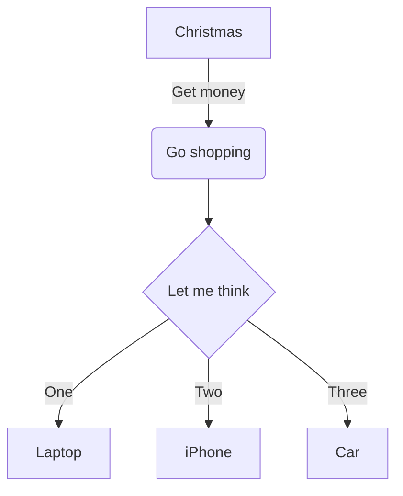

### MarkDown 时序图

``` sequence
 title : 这个是标题
 Alice -> Bob: Hello,how are you?
 Note right of Bob:Bob thinks
 Bob --> Alice: Thinks

```

``` sequence
Title: Here is a title
A->B: Normal line
B-->C: Dashed line
C->>D: Open arrow
D-->>A: Dashed open arrow
```

``` sequence
# Example of a comment.
Note left of A: Note to the\n left of A
Note right of A: Note to the\n right of A
Note over A: Note over A
Note over A,B: Note over both A and B
```
``` sequence
participant C
participant B
participant A
Note right of A: By listing the participants\n you can change their order
```

